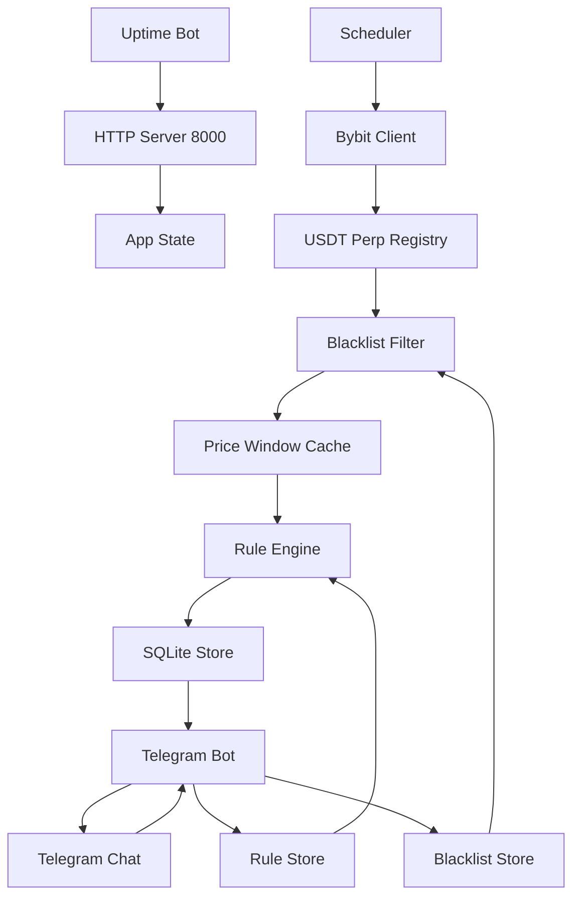

# План MVP Pumpscreener

## Цель
Собрать Telegram-бота, который сканирует все Bybit `USDT` perpetual-контракты, исключает монеты из черного списка и проверяет глобальные правила пользователя: направление движения, процент, временное окно и cooldown уведомлений. Каждое правило применяется ко всем разрешенным монетам.

## Рекомендуемый стек
- Go 1.22+ как основной стек для слабого сервера: низкая память, быстрые WebSocket-потоки, один бинарник.
- Telegram Bot API через легкую Go-библиотеку или прямые HTTP-запросы.
- Bybit V5 REST API и public WebSocket через стандартный `net/http` плюс минимальную WebSocket-библиотеку.
- Легкий HTTP-сервер на стандартном `net/http` в том же процессе для health/uptime endpoints.
- SQLite для локального хранения правил, последних сигналов и дедупликации через Go driver.
- `.env` для `TELEGRAM_BOT_TOKEN`, `TELEGRAM_CHAT_ID`, настроек Bybit и polling-интервала.
- Код должен быть рассчитан на слабый VPS: один процесс, один бинарник, минимум зависимостей, без ORM/очередей/тяжелых runtime-компонентов.

## Архитектура


## Основные модули в существующей структуре
Используем уже созданную папковую структуру как Go-пакеты: `src/application`, `src/core`, `src/domain`, `src/infrastructure`.

`src/domain`:
- модели правил, сигналов, blacklist и рыночных тиков;
- value objects для `Direction`, `Percent`, `Interval`, `Cooldown`;
- чистая логика проверки `up/down` без Telegram, Bybit и SQLite.

`src/application`:
- use cases для добавления, удаления, паузы и просмотра правил;
- orchestration скринера: принять тик, обновить price window, проверить глобальные правила, сформировать сигнал;
- in-memory индексы правил и cooldown по связке `rule_id + symbol`.

`src/infrastructure`:
- Bybit V5 REST-клиент для списка `USDT` perpetual-инструментов;
- Bybit public WebSocket `tickers` для цен в реальном времени;
- SQLite repository для правил, blacklist, сигналов и cooldown;
- Telegram adapter с командами `/add`, `/rules`, `/delete`, `/pause`, `/resume`, `/blacklist`;
- HTTP adapter на порте `8000` с `/`, `/uptime`, `/health` и `HEAD /health`.

`src/core`:
- загрузка `.env`, настройки, логирование, app state;
- wiring зависимостей, `context.Context`, graceful shutdown и запуск goroutines;
- общие утилиты времени, форматирования uptime и парсинга интервалов.

В корне проекта:
- `README.md`: инструкция запуска и настройки.
- `.env.example`: пример конфигурации без секретов.
- `go.mod` и `go.sum`: зависимости проекта.
- `main.go`: точка входа, которая собирает зависимости и запускает сервис.
- `README.md`: инструкция запуска и настройки.
- `.env.example`: пример конфигурации без секретов.

## Модель динамического правила
Формат правила:
```text
[DIRECTION] [MOVE_PERCENT] [INTERVAL] [NOTIFICATION_COUNTDOWN]
```

Примеры:
```text
up 3 30m 15m
down 5 1h 30m
up 10 15m 10m
```

Поля:
- `DIRECTION`: `up` для роста или `down` для падения.
- `MOVE_PERCENT`: процент движения цены, например `3` означает `3%`.
- `INTERVAL`: окно проверки, например `5m`, `30m`, `1h`.
- `NOTIFICATION_COUNTDOWN`: минимальная пауза между уведомлениями по этому правилу.

Правило не содержит монету. Оно применяется ко всем разрешенным Bybit `USDT` perpetual-парам, кроме blacklist.

## Мониторинг всех Bybit USDT perpetual пар
Бот должен поддерживать глобальный мониторинг всех Bybit `USDT` perpetual-контрактов.

Поведение:
- при старте получить список активных Bybit `USDT` perpetual-инструментов через V5 REST `market/instruments-info`;
- периодически обновлять список, например раз в 30-60 минут;
- хранить rolling cache цен по всем разрешенным парам, потому что правила глобальные;
- получать текущие цены через Bybit public WebSocket `tickers`;
- если пара попала в blacklist, она исключается из проверки всех правил.

## Оптимизация под слабый сервер
Ключевой принцип: один процесс Go, компактные структуры данных, bounded goroutines и проверка только обновленного символа.

Решения:
- использовать Bybit public WebSocket `tickers` с подписками на разрешенные perpetual-пары;
- парсить только `symbol`, `close price` и `event time`, игнорируя лишние поля;
- хранить price window только для разрешенных Bybit `USDT` perpetual-пар, потому что правила применяются ко всем монетам;
- не использовать ORM и тяжелые планировщики;
- держать правила в памяти и синхронизировать с SQLite только при изменениях через Telegram-команды;
- при приходе новой цены по символу проверять глобальные правила только для этого символа;
- очищать старые точки окна сразу после добавления новой цены;
- ограничить максимальное окно правила, например `24h`, чтобы память не росла бесконечно;
- добавить настройки `MAX_INTERVAL`, `MAX_RULES`, `MAX_POINTS_PER_SYMBOL` для защиты слабого сервера.
- использовать buffered channels с ограниченным размером, чтобы при всплесках данных не раздувать память;
- делать backoff reconnect для WebSocket без busy loop.

Для слабого сервера лучше сразу заложить ring buffer плюс monotonic queue по каждому символу: минимум для `up` и максимум для `down` будут доставаться за O(1), без постоянного поиска по всему окну.

## Черный список монет
Blacklist нужен, чтобы не трекать мусорные, слишком рискованные или ненужные монеты.

Формат:
- хранить blacklist в SQLite;
- поддерживать дефолтный blacklist из `.env`, например `BLACKLIST=FDUSDUSDT,TUSDUSDT,USDCUSDT`;
- применять blacklist до сбора цен и до проверки правил.

Telegram-команды:
- `/blacklist`: показать текущий черный список.
- `/blacklist_add BTCUSDT`: добавить пару в черный список.
- `/blacklist_remove BTCUSDT`: удалить пару из черного списка.

## Логика срабатывания
Правило должно срабатывать не только в конце окна, а сразу при достижении условия внутри окна.

Для `up`:
- берем минимальную цену за последние `INTERVAL`;
- если текущая цена выросла от этого минимума на `MOVE_PERCENT` или больше, отправляем сигнал.

Для `down`:
- берем максимальную цену за последние `INTERVAL`;
- если текущая цена упала от этого максимума на `MOVE_PERCENT` или больше, отправляем сигнал.

После уведомления правило уходит в cooldown на `NOTIFICATION_COUNTDOWN`. Это защищает от повторных сообщений, пока движение продолжается.

Cooldown считается по связке `rule_id + symbol`, чтобы одно правило могло отправить сигнал по `BTCUSDT`, а затем отдельно по `ETHUSDT`, если обе монеты выполнили условие.

## Telegram-команды MVP
- `/add up 3 30m 15m`: добавить глобальное правило.
- `/rules`: показать активные правила с ID.
- `/delete 3`: удалить правило по ID.
- `/pause 3` и `/resume 3`: временно выключить или включить правило.
- `/blacklist`, `/blacklist_add BTCUSDT`, `/blacklist_remove BTCUSDT`: управлять исключенными парами.
- `/status`: показать состояние скринера, количество правил и время последней проверки.

## Web app и uptime endpoints
Сервис должен запускаться как веб-приложение на порте `8000`, даже если основной интерфейс остается в Telegram.

Endpoints:
- `GET /`: короткая HTML или text-страница со статусом сервиса.
- `GET /uptime`: человекочитаемый uptime, например `Uptime: 2d 03h 14m 22s`, плюс состояние WebSocket, количество активных пар и правил.
- `GET /health`: простой ответ `OK` для health checks.
- `HEAD /health`: endpoint без тела ответа для uptime-ботов, которые проверяют только HTTP status.

Поведение:
- если процесс жив и event loop отвечает, `/health` и `HEAD /health` возвращают `200`;
- если Bybit WebSocket переподключается, `/uptime` показывает degraded-состояние, но процесс не падает;
- порт задается через `.env`, по умолчанию `PORT=8000`.

Формат сообщения:
```text
RULE TRIGGERED: BTCUSDT up
Move: +3.4% within 30m
Rule: +3.0% / 30m
Price: 104250.12 USDT
Cooldown: 15m
Bybit: https://www.bybit.com/trade/usdt/BTCUSDT
```

## Этапы реализации
1. Инициализировать Go-проект (`go.mod`, `main.go`) и зависимости, не меняя существующие папки `src/application`, `src/core`, `src/domain`, `src/infrastructure`.
2. Добавить конфиг, `.env.example`, app state и graceful shutdown в `src/core`.
3. Реализовать domain-модели и rule engine в `src/domain`.
4. Реализовать price window, cooldown и use cases управления правилами в `src/application`.
5. Реализовать Bybit V5 REST-клиент, public WebSocket stream и registry пар в `src/infrastructure`.
6. Реализовать SQLite-хранилище правил, blacklist, сигналов и cooldown-состояния в `src/infrastructure`.
7. Подключить Telegram adapter и команды управления правилами и blacklist в `src/infrastructure`.
8. Добавить HTTP adapter на порте `8000` с `/`, `/uptime`, `/health` и `HEAD /health`.
9. Собрать запуск приложения через `main.go`, используя goroutines, `context.Context` и graceful shutdown.
10. Добавить README с запуском: установка, переменные окружения, старт сервиса.
11. Проверить локально без реальных алертов через dry-run/log режим, затем через тестовый Telegram chat.

## Важные решения по умолчанию
- Начать с Bybit `USDT` perpetual.
- Использовать Bybit public WebSocket `tickers` для цен, а REST только для списка инструментов и служебных проверок.
- Запускать Telegram-бота, Bybit stream и HTTP-сервер в одном Go-процессе с контролируемыми goroutines.
- Правила хранить в SQLite и менять через Telegram-команды без перезапуска.
- Для расчета окна хранить локальный rolling cache по всем разрешенным Bybit `USDT` perpetual-парам, так как правила глобальные.
- Blacklist применять централизованно, чтобы исключенная монета не попадала ни в сбор цен, ни в проверку правил.
- Не хранить API keys Bybit, так как для публичных market data они не нужны.